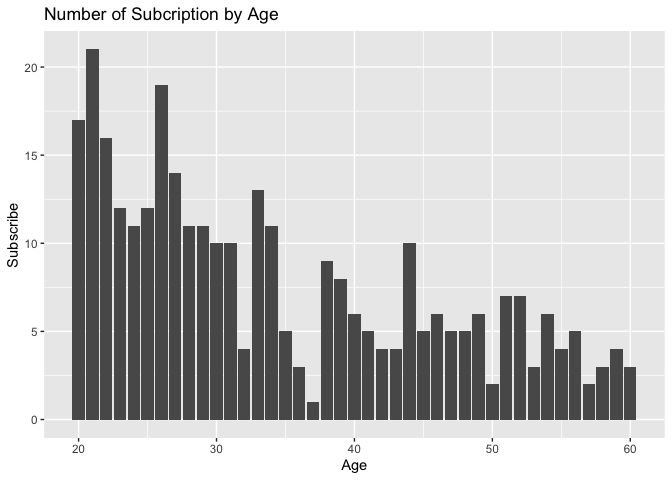
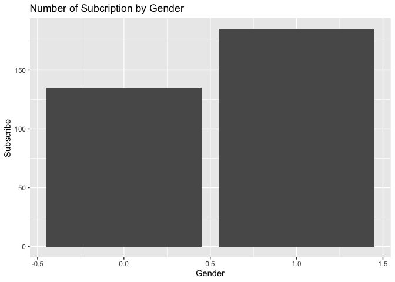

## Report:

## This dataset contains information of subscribers who either subscribed or nor subscribed to a magazine. We are tasked to predict which segment of the customers are more likely to subscribe.

#table content

``` r
data <- read.csv("/Users/zikangchen97/Desktop/Columbia/5072 QMSS/HW1/homework-1/src/hw_file/subscribed_data.csv")
df <- data.frame(data)
```

``` r
str(df)
```

    ## 'data.frame':    1345 obs. of  3 variables:
    ##  $ Age      : int  33 45 57 32 56 60 40 55 27 48 ...
    ##  $ Gender   : int  0 1 0 1 0 1 0 0 0 1 ...
    ##  $ Subscribe: int  0 0 0 0 0 1 0 0 0 0 ...

The three variables included in the dataset are: 1.Gender of the user 1
being female and 0 being male. 2.Age of the user. This variable takes on
numerics value 3.A binary variabel indicating whether the user
subscribed to the magazine or not

## Including Plots

``` r
library(ggplot2)
ggplot(data = df, aes(x=Age, y=Subscribe)) + 
  geom_bar(stat = "identity") + ggtitle("Number of Subcription by Age")
```



``` r
ggplot(data = df, aes(x=Gender, y=Subscribe)) + 
  geom_bar(stat = "identity") + ggtitle("Number of Subcription by Gender")
```



Conclusion: 1. As age increases, the subscription rate decreases among
subscribers. People from the age 20-32 accounts for the majority of the
subscriptions. 2. Female users are more likely to subscribe to the
magazine than male users.

Credits and Reference Link:
“<https://github.com/bonheurgirl/Machine-Learning-R/blob/master/2.Predict%20Magazine%20Subscription%20Behavior%20-%20Logistic%20Regression.R>”

Note that the `echo = FALSE` parameter was added to the code chunk to
prevent printing of the R code that generated the plot.
